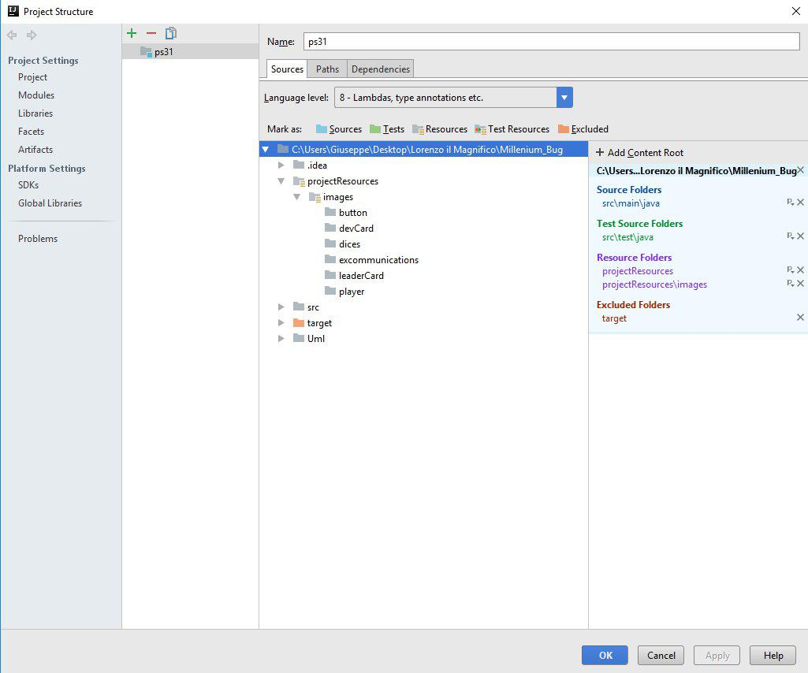

# LORENZO IL MAGNIFICO

Prova finale di Ingengneria Informatica - Politecnico di Milano - a.a. 2016/17 Versione digitale, multiplayer e online del gioco da tavolo creato e distribuito da Cranio Creations.

## 1. Requisiti sviluppati
Con riferimento alla documentazione fornita, si indicano qui i requisiti sviluppati nel corso del progetto.

### 1.1 Requisiti game-specific
Sono state implementate le regole **complete**, comprensive quindi di Effetti Permanenti, Scomuniche e Carte Leader

### 1.2. Requisiti game-agnostic
#### 1.2.1. Architettura client-server
Il sistema è progettato per poter funzionare online sulla base della architettua client-server. Le specifiche relative a questo aspetto sono le seguenti:

* Il server è istanziabile una sola volta e comunica con più client contemporaneamente.
* Il server è in grado di gestire più partite in simultanea.
* La comunicazione client-server è stata implementata solo su tecnologia **socket**.
* Il client è istanziabile più volte e su ogni istanza può essere attivo un solo giocatore alla volta.
* Sono state sviluppate entrambe le interfacce utente: CLI e GUI; la scelta di quale UI usare è presa dal giocatore all'avvio del client.
* La GUI è stata sviluppata utilizzando **Swing**.
* L'intero sistema funziona sfruttando il pattern architetturale **MVC**.

#### 1.2.2. Configurazione da file
Il gioco è configurabile da file e all'avvio del server vengono caricate tutte le impostazioni seguenti:

* Bonus associati a Spazi Azione, Plancia Giocatore e Tracciato Punti Fede;
* Carte Sviluppo;
* Carte Scomunica;
* Carte Leader;
* Timeout attesa giocatori;
* Timeout attesa mossa player.

#### 1.2.3. Avvio della partita
La connessione di un client avviene secondo le seguanti fasi:

* Il server controlla se c'è una partita in attesa di altri giocatori;
* In caso affermativo il giocatore viene aggiunto a quella partita, in caso contrario ne viene avviata una nuova;
* Quando a una partita viene connesso il secondo giocatore, parte un timeout entro il quale altri giocatori hanno la possibilità di connettersi alla partita;
* Allo scadere del timeout la partita inizia con i giocatori collegati;
* Quando una partita raggiunge i 4 giocatori connessi, parte **immediatamente**.

#### 1.2.4. Timeout
Se durante una partita un giocatore impiega troppo tempo ad eseguire le sue azioni, il timeout associato scadrà e il giocatore perderà il turno, con le eventuali risorse fino ad allora spese.

#### 1.2.5. Disconnessioni
Durante una partita è possibile che un giocatore si disconnetta. In questo caso vengono applicate le seguenti regole:

* Il giocatore perde tutti i turni da quel momento fino alla sua riconnessione;
* La riconnessione è possibile tramite un semplice meccanismo di autenticazione:
	* Ogni giocatore, alla connessione, deve indicare uno username e una password;
	* Tali credenziali rimangono attive per tutta la durata della partita
	* In caso di disconnessione è sufficiente reinserire le credenziali per riprendere la partita interrotta
	* Si assume che gli username siano stati registrati in precedenza e che non possano esistere due player con lo stesso username
* Tutti i player vengono notificati della disconnessione di un avversario

### 1.3. Funzionalità avanzate
Nessuna delle due funzionalità avanzate richieste è stata implementata.

### 1.4. Riepilogo
Riepilogando, i requisiti implementati sono stati i seguenti:

* Regole semplificate
* Regole complete
* CLI
* GUI
* Socket
* Configurazione da file
* Gestione disconnessioni

## 2. Istruzioni per il lancio dell'applicazione
Per lanciare l'applicazione è necessario seguire i seguenti passi

* Aprire il progetto in un ambiente di sviluppo java (Eclipse, Intellij,...)
* **_Assicurarsi che sia la cartella projectResources che la sua sottocartella Images siano settate come cartelle di risorse (vedi figura)_**
* Lanciare un'istanza della classe Server nel package server
* Lanciare due o più istanze della classe Client nel package client
* Allo scadere del timeout, o al raggiungimento di 4 player collegati, si apriranno le finestre contenenti le interfacce di gioco, pronte per essere utilizzate.
* NB: se con interfaccia GUI dovessero presentarsi dei problemi di caricamento delle immagini, seguire i seguenti passi:
	* terminare tutte le esecuzioni in corso;
  	* togliere il flag di _cartelle di risorsa_ dalle directory **projectResources** e **Images**;
  	* ricompilare il progetto;
  	* settare nuovamente le due directory come cartelle di risorse;
 	* Eseguire nuovamente il server e i client.
* **La risoluzione minima consigliata per giocare con la CLI è di 1366x768**

## 3. Diagramma UML
Di seguito vengono mostrati i class diagram del progetto. Quello iniziale, da cui si è partiti per lo sviluppo del model, e quelli finali, divisi tra le funzionalità principali in modo da ridurne la complessità. In questa seconda parte sono disponibili due documenti per ogni funzionalità: uno con le classi estese e indicati le sole relazioni di ereditarietà; l'altro con i soli nomi delle classi e indicate ache le relazioni di dipendenza

**Tutti i file sono disponibili nella directory _Uml/_ in due formati: .svg e .uml (il diagrama iniziale solo in .svg)**

### 3.1. UML iniziale
Questo documento contiene la prima bozza di class diagram sviluppato per il progetto. Le classi in esso contenute corrispondono a quelle del Model.
[Documento disponibile qui](/UML/UML_Draft.svg)

### 3.2. UML finali
* UML Model
  	* [versione semplificata](/Uml/Model/model.svg)
  	* [verisone estesa](/Uml/Model/model_dependencies.svg)
* UML Architettura MVC
  	* [versione semplificata](/Uml/MVC/MVC.svg)
  	* [versione estesa](/Uml/MVC/MVC.svg)
* UML Networking
  	* [versione semplificata](/Uml/Networking/netowriking.svg)
  	* [versione estesa](/Uml/Networking/networking.svg)

Per completezza, esiste anche una versione completa del class diagram, contenente tutte le classi. Anche questo documento è disponibile in versione [ridotta](/Uml/ProgettoCompleto/complete.svg) o [estesa](/Uml/ProgettoCompleto/complete_dependencies.svg)

## 4. Info aggiuntive

### 4.1. Design Pattern
Durante lo sviluppo del software si è reso necessario il ricorso a più design pattern. In particolare:

* pattern Singleton per alcune classi del server che non devono essere instanziabili più volte (SocketAccepter, MatchTable,...)
* pattern Visitor per la decodifica dei messaggi tra model, view e controller
* pattern State per gestire il comportamente della view sul client
* pattern Facade per gestire la complessità di certe strutture logiche (es. networking)
* pattern Observer per la gestione della architettura MVC

### 4.2. Librerie esterne
Per una migliore gestione di alcuni aspetti specifici del progetto, si è fatto ricorso a librerie e framework esterni:

* Gson: per la serializzazione e deserializzazione dei messaggi tra client e server
* Lanterna: per la realizzazione della CLI (solo parte di command line)

### 4.3. Sviluppi futuri
Molteplici sono i possibili miglioramenti applicabili al software nelle prossime versioni. Si annotano, in ordine di fattibilità e tempo di sviluppo previsto:

* pulizia dei messaggi di debug e di controllo stampati nelle console di client e server;
* ricerca dettagliata e minuziosa di eventuali bug sfuggiti nella prima fase;
* sviluppo delle funzioni non implementate in questa versione: connessione RMI, persistenza di gioco e quinto giocatore;
* studi approfonditi sulla usabilità delle interfacce giocatore e loro miglioramento;
* sviluppo di un tool user-friendly per la gestione del file di configurazione;
* introduzione di bot per partite single player;

### 4.4. Note sui test
* La copertura dei test di unità sul package _model_, aggiornata al 11/07/2017, è pari a: 57% delle classi, 21% dei metodi e 16% delle linee. Valori così bassi sono giustificabili dalla forte interazione tra le varie classi e i loro metodi, che rendono difficoltosa la ricerca di una copertura maggiore senza l'uso di test di intergrazione o di sistema.
* Per alcuni metodi non sono stati definiti dei casi di test negativi, in quanto essi si sarebbero ridotti ad una mera negazione logica di quelli positivi.

### 4.5. Ulteriori note
* sebbene non sia stata implementata, la connessione RMI è facilmente inseribile tramite estensione di apposite classi.
* già in questa versione, il giocatore ha facoltà di _"scegliere"_ quale tecnologia usare per la connessione al server. Tuttavia, in ogni caso, verrà istanziata una comunicazione tramite socket.
* il file di configurazione è in formato json e, oltre ad essere fornito con la presente release, è creato runtime all'avvio di una partita in caso non sia già presente nella directory projectResources.
* Lo sviluppo è avvenuto esclusivamente attraverso il software Intellij IDEA 2017.1.1
